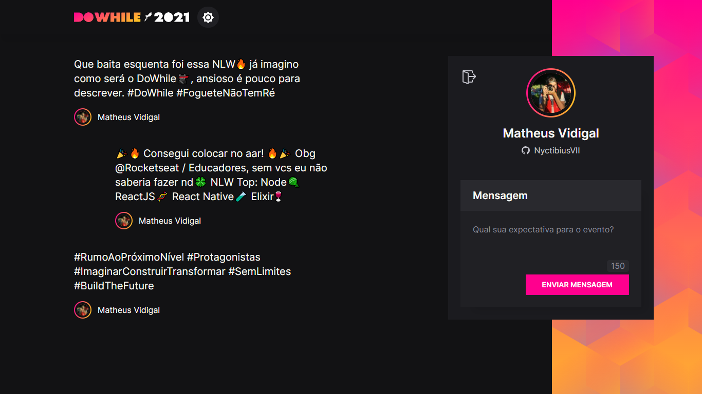
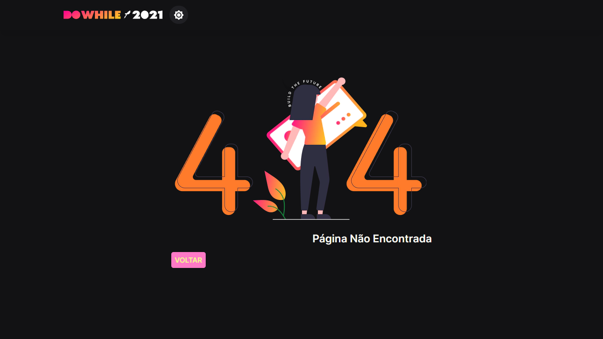

# IMGS
##### Desktop Screenshot

 

## Desktop Screenshot

<!-- Responsive, 1440 x 900, 50% (Laptop L - 1440px)-->
    
    
    
    
    

    <!-- IMGS
      ------------------------------
      splash
      ------------------------------
      home
      home-logged
      home-logged-typing
      ------------------------------
      toast
      ------------------------------
      404
      ------------------------------
    -->