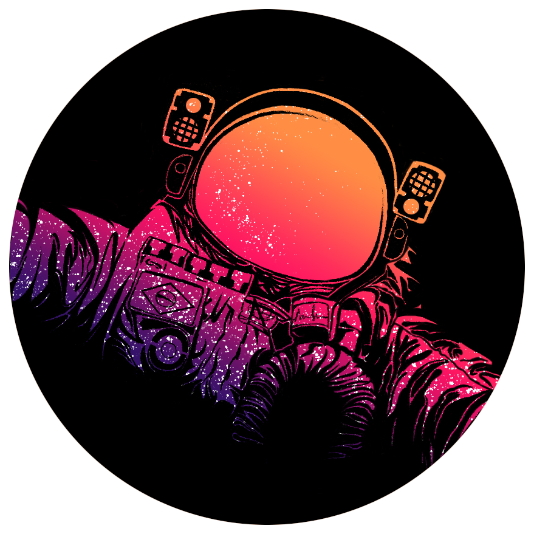

<h1 align="center">
    <br>
    
</h1>
<h4 align="center">
    Trilha Impulse <br>
</h4>
<!-- <h4 align="center">Projeto web construído durante o Next Level Week #07-Impulse com a Rocketseat/DiegoFernandes|DanieleLeão.</h4> -->
<p align="center">
    
    <a aria-label="Completado" href="https://nextlevelweek.com/episodios/impulse/aula-5/edicao/7">
        </img>
    </a>
    
    <a href="https://github.com/NyctibiusVII/HeatsUp/blob/main/LICENSE">
        
    </a>
    <a href="https://picpay.me/Matheus_nyctibius_vii">
        
    </a>
</p>
<p align="center">
    <a href="#heatsup-">Projeto</a>&nbsp;&nbsp;&nbsp;|&nbsp;&nbsp;&nbsp;
    <a href="#tecnologias-">Tecnologias</a>&nbsp;&nbsp;&nbsp;|&nbsp;&nbsp;&nbsp;
    <a href="#layout-">Layout</a>&nbsp;&nbsp;&nbsp;|&nbsp;&nbsp;&nbsp;
    <a href="#licença-%EF%B8%8F">Licença</a>
</p>
<!--
<p align="center">
    <a href="README.md">Inglês</a>
    ·
    <a href="README-pt.md">Português</a>
</p>
-->

# HeatsUp 
Projeto desenvolvido para fazer um esquenta pre-eventos. O projeto é um mural de depoimentos, expectativa e mensagens em geral. Projeto realizado na Next Level Week #7 @Rocketseat.

#### Funcionalidades
* Chat em tempo real
* Bate-papo pre-evento
* App responsivo
* Light/Dark mode
* Restrição de (158) palavras de 'baixo escalão'
* SQLite

<details>
    <summary>Desafios</summary>

```
GERAL:
    ✔ - Documentar bem o projeto
    [2/3] - Migração de npm para yarn (WEB: y; MOBILE: n; NODE: y; ELIXIR: nil)

DESKTOP:
    ✔ - NO AR (Online / Vercel)
    ✔ - SEO:
        ✔ - Texto para <noscript />
        ✔ - Shortcut icon
        ✔ - Meta tags:
            ✔ - Facebook (og:~)
            ✔ - Twitter (twitter:~)
        ✔ - Sitemap (sitemap.xml / automatico com 'next-sitemap')
        ✔ - Robots (robots.txt / automatico com 'next-sitemap')
    - Melhorar o estilo:
        ✔ - Mobile First
        ✔ - Responsividade
        ✔ - Design
        ✔ - Trocar o tema da aplicação:
            ✔ - Light
            ✔ - Dark
            ✔ - Imagens adaptadas para o 'light e dark'
        ✔ - +Animações (framer-motion)
        - Cores:
            ✔ - Seleção do mouse (:selection)
            ✖ - adaptadas para daltônicos
    ✔ - Toast
    ✔ - ER (Expressão Regular) no input para restringir palavras proibidas
    ✔ - Perfil no 'head' da web
    ✔ - Ponteiro do mouse personalizado
    - Telas:
        ✔ - Home
        ✔ - Home/Logged
        ✖ - Profile (crachá compartilhável)
        ✔ - 404

MOBILE:
    ✖ - NO AR (Online / Apple Store && Google Play)
    - Melhorar o estilo:
        ✖ - Design
        ✖ - Trocar o tema da aplicação:
            ✖ - Light
            ✖ - Dark
            ✖ - Imagens adaptadas para o 'light e dark'
        ✔ - +Animações (framer-motion)
        ✖ - Cores:
            ✖ - adaptadas para daltônicos
    - Telas:
        ✔ - splash
        ✔ - Home
        ✔ - Home/Logged
        ✖ - Profile (crachá compartilhável)
    ✖ - ER (Expressão Regular) no input para restringir palavras proibidas
    ✔ - Toast

NODE:
    ✔ - NO AR (Online / Heroku)
    ✔ - oAuth github
    [2/3] - Identificar de onde vem as requisições (WEB: y; MOBILE: y; NODE: ~dev...; ELIXIR: nil)
    ✔ - ORM (Prisma)
    - Banco de dados:
        ✔ - SQLite *Banco atual*
        ✖ - Migrar banco de dados de 'SQLite' para 'MongoDB'
        ✖ - MongoDB:
            ✖ - Guardar dados
            ✖ - Alterar dados
            ✖ - Deletar dados

ELIXIR:
    ✖ - NO AR (Online / ~)
    ✔ - Separar a mensagem de 150 caracteres em palavras
        ✔ - Contar a ocorrência de cara palavra
    ✔ - Processamento concorrente
    ✔ - Agendador de geração de relatórios
    ✔ - Rodando todo dia a meia noite (-e["0 0 * * *"] ou @daily)
    ✖ - Validação de erros (fallback_controller)
    ✖ - Word Cloud:
        ✖ - Gerar imagem com python
        ✖ - Enviar e-mail com a 'WordCloud' do dia (Bamboo)
```
</details>

## Tecnologias 🚀
Esse projeto foi desenvolvido com as seguintes tecnologias:
<details>
    <summary>WEB___</summary>
    <a href='https://nextjs.org'>Next.js | 11.1.2</a><br>
    <a href='https://reactjs.org'>React | 17.0.2</a><br>
    <a href='https://www.typescriptlang.org'>Typescript | 4.4.4</a><br>
    <a href='https://sass-lang.com'>SASS | ^1.43.3</a><br>
    <a href='https://socket.io'>Socket.io | ^4.3.1</a>
</details>
<details>
    <summary>MOBILE___</summary>
    <a href='https://reactnative.dev'>React-native | sdk-42.0.0</a><br>
    <a href='https://reactjs.org'>React | 16.13.1</a><br>
    <a href='https://expo.io'>Expo | ~42.0.1</a><br>
    <a href='https://moti.fyi'>Moti | ^0.16.0</a><br>
    <a href='https://www.typescriptlang.org'>Typescript | ~4.0.0</a><br>
    <a href='https://socket.io'>Socket.io | ^4.3.1</a>
</details>
<details>
    <summary>NODE___</summary>
    <a href='https://nodejs.org/en/'>NodeJS | ^14.17.3</a><br>
    <a href='https://expressjs.com/pt-br'>Express | ^4.17.1</a><br>
    <a href='https://www.prisma.io'>Prisma | ^3.3.0</a><br>
    <a href='https://www.typescriptlang.org'>Typescript | ^4.4.4</a><br>
    <a href='https://www.sqlite.org'>SQLite | ^3.36.0</a><br>
    <a href='https://jwt.io/'>JWT | ^8.5.1</a>
</details>
<details>
    <summary>ELIXIR___</summary>
    <a href='https://elixir-lang.org'>Elixir | 1.11.2 / OTP 21</a><br>
    <a href='https://phoenixframework.org'>Phoenix | ~> 1.6.2</a><br>
    <a href='https://jason.im'>Jason | ~> 1.2</a><br>
    <a href='https://swoosh.dev'>Swoosh | ~> 1.3</a><br>
    <a href='https://quantum.dev'>Quantum | ~> 3.0</a>
</details>

## Layout 🚧
### Desktop Screenshot
<div style="display: flex; flex-direction: 'column'; align-items: 'center';">
<!-- Responsive, 1440 x 900, 50% (Laptop L - 1440px)-->
    
    
    
    <!---->
    
</div>
<a href="./.github/README-IMGS.md">Ver mais</a>

### Mobile (Web) Screenshot
<div style="display: flex; flex-direction: 'row';">
<!-- Responsive, 425 x 900, 60% (Mobile L - 425px)-->
    <!---->
    
    
    
    
</div>
<a href="./.github/README-IMGS.md">Ver mais</a>
    <!-- IMGS
      ------------------------------
      splash
      ------------------------------
      home
      home-logged
      home-logged-typing
      ------------------------------
      toast
      ------------------------------
      404
      ------------------------------
    -->
    
### Exemplo de uso do Site


## Rodando o projeto 🚴🏻‍♂️
#### "Só vou dar uma olhadinha...":
  <a href="https://heatsup-nyctibiusvii.vercel.app/">💬 Site hospedado na Vercel 🤸‍♀️</a>

#### Na sua maquina:
<details>
    <summary>Dependências</summary>

```json
  ------- NODE -------
  "dependencies": {
    "@prisma/client": "^3.3.0",
    "axios": "^0.23.0",
    "cors": "^2.8.5",
    "dotenv": "^10.0.0",
    "express": "^4.17.1",
    "jsonwebtoken": "^8.5.1",
    "socket.io": "^4.3.1",
    "ts-node": "^10.4.0"
  },
  "devDependencies": {
    "@types/axios": "^0.14.0",
    "@types/cors": "^2.8.12",
    "@types/express": "^4.17.13",
    "@types/jsonwebtoken": "^8.5.5",
    "@types/node": "^16.11.4",
    "@types/socket.io": "^3.0.2",
    "prisma": "^3.3.0",
    "ts-node-dev": "^1.1.8",
    "typescript": "^4.4.4"
  }

  ------- WEB -------
  "dependencies": {
    "axios": "^0.23.0",
    "framer-motion": "^4.1.17",
    "next": "11.1.2",
    "next-themes": "^0.0.15",
    "react": "17.0.2",
    "react-dom": "17.0.2",
    "react-icons": "^4.3.1",
    "react-toast-notifications": "^2.5.1",
    "sass": "^1.43.3",
    "socket.io-client": "^4.3.2"
  },
  "devDependencies": {
    "@types/react": "17.0.31",
    "@types/react-dom": "^17.0.10",
    "eslint": "8.0.1",
    "eslint-config-next": "11.1.2",
    "next-sitemap": "^1.6.192",
    "typescript": "4.4.4"
  }

  ------- MOBILE -------
  "dependencies": {
    "@expo-google-fonts/roboto": "^0.2.0",
    "axios": "^0.23.0",
    "expo": "~42.0.1",
    "expo-app-loading": "1.1.2",
    "expo-auth-session": "~3.3.1",
    "expo-font": "~9.2.1",
    "expo-linear-gradient": "~9.2.0",
    "expo-random": "~11.2.0",
    "expo-status-bar": "~1.0.4",
    "moti": "^0.16.0",
    "react": "16.13.1",
    "react-dom": "16.13.1",
    "react-native": "https://github.com/expo/react-native/archive/sdk-42.0.0.tar.gz",
    "react-native-iphone-x-helper": "^1.3.1",
    "react-native-reanimated": "~2.2.0",
    "react-native-svg": "12.1.1",
    "react-native-web": "^0.17.5",
    "socket.io-client": "^4.3.2",
    "@react-native-async-storage/async-storage": "~1.15.0"
  },
  "devDependencies": {
    "@babel/core": "^7.9.0",
    "@types/react": "~16.9.35",
    "@types/react-native": "~0.63.2",
    "react-native-svg-transformer": "^0.14.3",
    "typescript": "~4.0.0"
  }
```
> Ex: `$ npm install _____` ou `$ yarn add _____` para instalar as dependências

> Utilize a tag `-D` para instalar as dependências de desenvolvimento.
> Utilize a tag `@types` para instalar o suporte a Typescript.
> Utilize a tag `@latest` para instalar a versão mais recente.

```elixir
------- ELIXIR -------
  defp deps do
    [
      {:phoenix, "~> 1.6.2"},
      {:phoenix_ecto, "~> 4.4"},
      {:ecto_sql, "~> 3.6"},
      {:postgrex, ">= 0.0.0"},
      {:phoenix_live_dashboard, "~> 0.5"},
      {:swoosh, "~> 1.3"},
      {:telemetry_metrics, "~> 0.6"},
      {:telemetry_poller, "~> 1.0"},
      {:gettext, "~> 0.18"},
      {:jason, "~> 1.2"},
      {:plug_cowboy, "~> 2.5"},
      {:quantum, "~> 3.0"}
    ]
  end
```
> Ex: `$ mix deps.get` para instalar as dependências

</details>

```bash
# Clone o repositório
$ git clone https://github.com/NyctibiusVII/HeatsUp.git

# Acesse a pasta do projeto no terminal
$ cd heatsup

# Acesse a pasta do sub-projeto no terminal:
$ cd node      # Projeto NodeJS
$ cd web       # Projeto NextJS
$ cd mobile    # Projeto React Native
$ cd wordcloud # Projeto Elixir

# Instale as dependências
$ npm install   /   yarn add # Serve para NodeJS, NextJS e React Native
$ mix deps.get               # Serve para Elixir

# Execute o sub-projeto:
# --------- PARA NODE ---------- #
$ npx prisma generate            # Para criar o banco de dados
$ npm run dev   /   yarn dev     # Para rodar o projeto Node (Backend)

# ---------- PARA WEB ---------- #
$ npm run dev   /   yarn dev     # Para rodar o projeto Web (Frontend)

# -------- PARA MOBILE --------- #
$ npm run start   /   yarn start # Para o projeto Mobile (Frontend Mobile)

# ------- PARA WORDCLOUD ------- #
# DISCLAIMER 1: Instale o Elixir e o Phoenix no terminal, isso não será explicado aqui.
# DISCLAIMER 2: Configure seu banco de dados no arquivo `config/dev.exs`
$ mix ecto.create                # Para criar o banco de dados
$ mix phx.server                 # Para rodar o projeto Elixir (Backend)

# O NodeJS roda na porta: 4000
# O NextJS roda na porta: 3000
# O React Native roda na porta: 19002
# O Elixir roda na porta: 4000

# Acesse http://localhost:$PORT *Ex: Cuidado para não ligar dois ou mais projetos na mesma porta, pois o servidor pode não iniciar.
```

## Contribuição 💭
Para construir essa aplicação tive a ajuda dos professores **Daniele Leão**, **Diego Fernandes**, **Rodrigo Gonçalves** e **Rafael Camarda** da Rocketseat que disponibilizou video aulas do projeto **HeatsUp** e ajudaram no ensino das respectivas
linguagens {
    NodeJS,
    ReactJS,
    React Native,
    Elixir
} além também de ter a ajuda desta grande comunidade que a Rocketseat construiu no *Discord*.
Feito com ♥ by Rocketseat :wave: [Participe da nossa comunidade!](https://discord.gg/TzHbnGtD)

### Hashtags \#
| Dias  | Hashtags                      |
|-------|-------------------------------|
| Dia 1 | #RumoAoPróximoNível           |
| Dia 2 | #Protagonistas                |
| Dia 3 | #ImaginarConstruirTransformar |
| Dia 4 | #SemLimites                   |
| Dia 5 | #BuildTheFuture               |

## Licença ⚖️
Este projeto está sob a licença do MIT. Veja o arquivo [LICENSE](https://github.com/NyctibiusVII/HeatsUp/blob/main/LICENSE) para mais detalhes.

## Contato ✉️
| <br><sub><a href="https://www.instagram.com/nyctibius_vii/?hl=pt-br">@MatheusVidigal🦊</a></sub> |
| :---: |

<p align="left">
    <a href="https://www.linkedin.com/in/matheus-vidigal-nyctibiusvii/">
        
    </a>
    <a href="https://mail.google.com/mail/u/1/#inbox?compose=GTvVlcSGLCKpKJfwPsKKqzXBplKkGtCLvCQcFWdWxCxQFfkHzzjVkgzrMFPBgKBmWFHvrjrCsMqSH">
        
    </a>
</p>