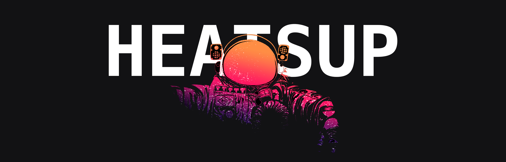
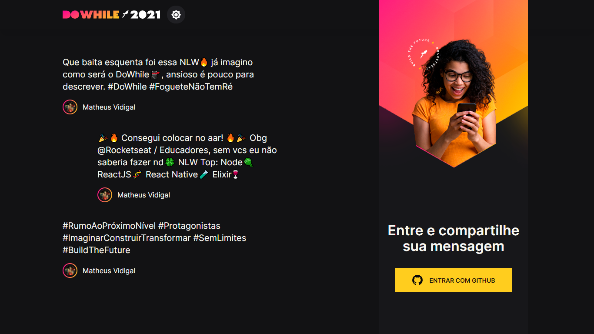
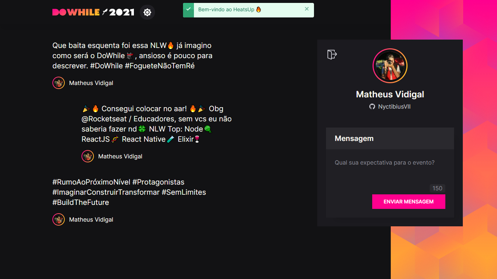
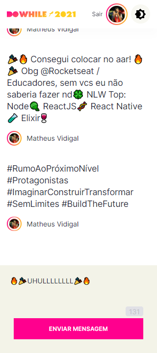
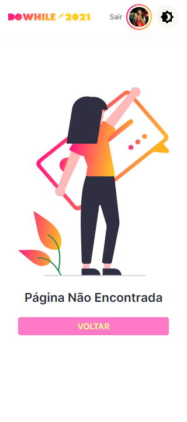

<h1 align="center">
    <br>
    
</h1>
<h4 align="center">
    Trilha Impulse <br>
</h4>
<!-- <h4 align="center">Projeto web construído durante o Next Level Week #07-Impulse com a Rocketseat/DiegoFernandes|DanieleLeão.</h4> -->
<p align="center">
    
    <a aria-label="Completado" href="https://nextlevelweek.com/episodios/impulse/aula-5/edicao/7">
        </img>
    </a>
    
    <a href="https://github.com/NyctibiusVII/HeatsUp/blob/main/LICENSE">
        
    </a>
    <a href="https://picpay.me/Matheus_nyctibius_vii">
        
    </a>
</p>
<p align="center">
    <a href="#heatsup-">Projeto</a>&nbsp;&nbsp;&nbsp;|&nbsp;&nbsp;&nbsp;
    <a href="#tecnologias-">Tecnologias</a>&nbsp;&nbsp;&nbsp;|&nbsp;&nbsp;&nbsp;
    <a href="#layout-">Layout</a>&nbsp;&nbsp;&nbsp;|&nbsp;&nbsp;&nbsp;
    <a href="#licença-%EF%B8%8F">Licença</a>
</p>
<!--
<p align="center">
    <a href="README.md">Inglês</a>
    ·
    <a href="README-pt.md">Português</a>
</p>
-->

# HeatsUp 
Projeto desenvolvido para fazer um esquenta pre-eventos. O projeto é um mural de depoimentos, expectativa e mensagens em geral. Projeto realizado na Next Level Week #7 @Rocketseat.

#### Funcionalidades
* Chat em tempo real.
* Bate-papo pre-evento.
* App responsivo.
* SQLite.

<details>
    <summary>Desafios</summary>

```
✔ - Documentar bem o projeto
- Melhorar o estilo: Responsividade e Design
- Mobile First
- Animações
✔ - Banco de dados (SQLite)

Funcionalidades:
    - Trocar o tema da aplicação: Light e Dark
    ✔ - oAuth github (Pagina de login)
    - Cores adaptadas para daltônicos
    - Expressão Regular no input para bloquear palavras proibidas
    ✔ - ORM (Prisma)
    - Migrar banco de dados de SQLite para (MongoDB)
    - MongoDB:
        - Guardar dados
        - Alterar dados
        - Deletar dados
    - Toast:
        - Animação de entrada e saida
    - Modal:
        - Logout
    - Telas:
        - splash
        - Home
        - Home/Logged
        - Profile (crachá compartilhável)
        - 404
```
</details>

## Tecnologias 🚀
Esse projeto foi desenvolvido com as seguintes tecnologias:
- [Html | 5](https://pt.wikipedia.org/wiki/HTML)
- [Typescript | ^4.4.4](https://www.typescriptlang.org/)
- [socket.io | ^4.3.1](https://socket.io/)
- [express | ^4.17.1](https://expressjs.com/pt-br/)
- [sqlite | ^3.36.0](https://www.sqlite.org/)
- [Prisma | ^3.2.1](https://www.prisma.io/)
- [NodeJS | ^14.17.3](https://nodejs.org/en/)

## Layout 🚧
### Desktop Screenshot
<div style="display: flex; flex-direction: 'column'; align-items: 'center';">
<!-- Responsive, 1440 x 900, 50% (Laptop L - 1440px)-->
    <!---->
    <!---->
    <!---->
    <!---->
    <!---->
    <!---->
</div>
<a href="./.github/README-IMGS.md">Ver mais</a>

### Mobile Screenshot
<div style="display: flex; flex-direction: 'row';">
<!-- Responsive, 425 x 900, 60% (Mobile L - 425px)-->
    <!---->
    <!---->
    <!---->
    <!---->
    <!---->
    <!---->
</div>
<a href="./.github/README-IMGS.md">Ver mais</a>
    <!-- IMGS
      ------------------------------
      splash
      ------------------------------
      home
      home-logged
      home-logged-typing
      ------------------------------
      modal-logged-out
      toast
      ------------------------------
      404
      ------------------------------
    -->

## Rodando o projeto 🚴🏻‍♂️
#### "Só vou dar uma olhadinha...":
  <a href="https://heatsup-nyctibiusvii.vercel.app/">💬 Site hospedado na Vercel 🤸‍♀️</a>

#### Na sua maquina:
<details>
    <summary>Dependências</summary>

```json
  ------- NODE -------
  "dependencies": {
    "@prisma/client": "^3.2.1",
    "axios": "^0.23.0",
    "cors": "^2.8.5",
    "dotenv": "^10.0.0",
    "express": "^4.17.1",
    "jsonwebtoken": "^8.5.1",
    "socket.io": "^4.3.1"
  },
  "devDependencies": {
    "@types/axios": "^0.14.0",
    "@types/cors": "^2.8.12",
    "@types/express": "^4.17.13",
    "@types/jsonwebtoken": "^8.5.5",
    "@types/socket.io": "^3.0.2",
    "prisma": "^3.2.1",
    "ts-node-dev": "^1.1.8",
    "typescript": "^4.4.4"
  }

  ------- WEB -------
  "dependencies": {
    "next": "11.1.2",
    "react": "17.0.2",
    "react-dom": "17.0.2"
  },
  "devDependencies": {
    "@types/react": "17.0.30",
    "eslint": "8.0.1",
    "eslint-config-next": "11.1.2",
    "typescript": "4.4.4"
  }

  ------- MOBILE -------
  "dependencies": {},
  "devDependencies": {}
```
> Ex: `$ npm install _____` para instalar as dependências

> Utilize a tag `-D` para instalar as dependências de desenvolvimento.
> Utilize a tag `@types` para instalar o suporte a Typescript.
> Utilize a tag `@latest` para instalar a versão mais recente.
</details>

```bash
# Clone o repositório
$ git clone https://github.com/NyctibiusVII/HeatsUp.git

# Acesse a pasta do projeto no prompt de comando
$ cd heatsup

# Instale as dependências
$ npm install

# ------- PARA NODE -------
# Acesse a pasta do projeto no prompt de comando
$ cd node

# Execute o script "dev-node"
$ npm run dev-node

# ------- PARA WEB -------
# Acesse a pasta do projeto no prompt de comando
$ cd web

# Execute o script "dev-web"
$ npm run dev-web

# ------- PARA MOBILE -------
# Acesse a pasta do projeto no prompt de comando
$ cd mobile

# Execute o script "dev-mobile"
$ npm run dev-mobile

# Cada projeto inicia na porta: 3000 - acesse http://localhost:3000 *Ex: Cuidado para não ligar dois ou mais projetos na mesma porta, pois o servidor pode não iniciar.
```

## Contribuição 💭
Para construir essa aplicação tive a ajuda do professor **Diego Fernandes** e **Daniele Leão** da Rocketseat que disponibilizou video aulas do projeto **HeatsUp** e tive uma ajuda desta grande comunidade que a Rocketseat construiu no *Discord*.
Feito com ♥ by Rocketseat :wave: [Participe da nossa comunidade!](https://discord.gg/YxU7fJT)

### Hashtags \#
| Dias  | Hashtags            |
|-------|---------------------|
| Dia 1 | #RumoAoPróximoNível |
| Dia 2 |                     |
| Dia 3 |                     |
| Dia 4 |                     |
| Dia 5 |                     |

## Licença ⚖️
Este projeto está sob a licença do MIT. Veja o arquivo [LICENSE](https://github.com/NyctibiusVII/HeatsUp/blob/main/LICENSE) para mais detalhes.

## Contato ✉️
| <br><sub><a href="https://www.instagram.com/nyctibius_vii/?hl=pt-br">@MatheusVidigal🦊</a></sub> |
| :---: |

<p align="left">
    <a href="https://www.linkedin.com/in/matheus-vidigal-nyctibiusvii/">
        
    </a>
    <a href="https://mail.google.com/mail/u/1/#inbox?compose=GTvVlcSGLCKpKJfwPsKKqzXBplKkGtCLvCQcFWdWxCxQFfkHzzjVkgzrMFPBgKBmWFHvrjrCsMqSH">
        
    </a>
</p>